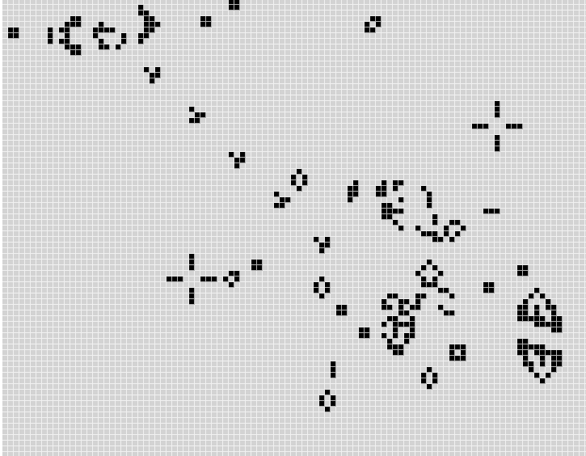
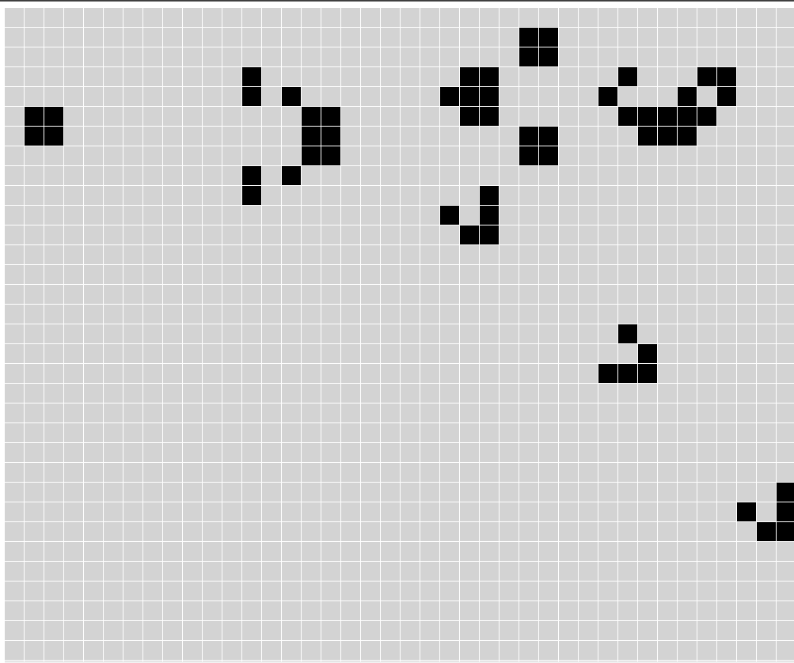

# Conway's Game of Life

This is a collection of implementations of Conway's game of life that is implemented in the browser.  These implementations include:

- HTML Canvas API (2D)
- Phaserjs (2D)
- Babylonjs (3D)

## Babylon

## Phaser

## Canvas

